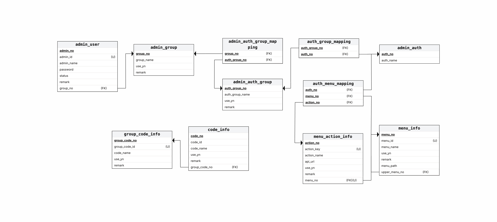

# adminDemo
# Admin IAM Demo (Auth/Permission)

Spring Boot 4 / Java 21 기반의 **관리자 인증·권한 데모 백엔드**입니다.  
“로그인 → JWT 발급 → 그룹 기반 권한 조회(QueryDSL) → Redis 캐시 warmup → 보호 API 접근” 흐름을 최소 구현했습니다.

## Tech
- Java 21, Spring Boot 4
- Spring Security (Stateless)
- PostgreSQL, Spring Data JPA
- QueryDSL
- Redis (권한 캐시)
- JJWT (Access/Refresh Token)
- 

## Architecture
- Hexagonal (Ports & Adapters) + DDD-lite
    - `iam.application`: 서비스
    - `iam.adapter.in.web`: Controller (/openApi, /adminApi)
    - `iam.adapter.in.security`: SecurityFilterChain, JWT Filter
    - `iam.adapter.out.persistence`: JPA Entity/Repository, QueryDSL 조회
    - `iam.adapter.out.redis`: Redis 캐시 저장/조회
    - 
## ERD


```md
## Sequence
- [Sequence Diagrams](docs/sequence.md)
```

## API Prefix
- `/openApi/**` : 공개
- `/adminApi/auth/**` : 로그인/리프레시 등 공개
- `/adminApi/**` : 인증 필요

## Run
1) PostgreSQL/Redis 실행
2) `application.yml` 설정
3) Boot Run

## Demo Scenario (HTTP)
### 1) Health
GET `/openApi/health`

### 2) Login
POST `/adminApi/auth/login`
- response: `accessToken`, `tokenType`

### 3) Warmup 권한 캐시
POST(or GET) `/openApi/dev/cache/warmup?groupNo=1`
- response: redis key

### 4) 보호 API 호출
Authorization: `Bearer {accessToken}`

## Notes
- roles를 토큰에 굽지 않고, 그룹 기반 권한을 캐시/DB에서 조회하도록 확장 예정
- 메뉴 트리/중복 제거/정렬은 데모 단순화를 위해 최소 처리


