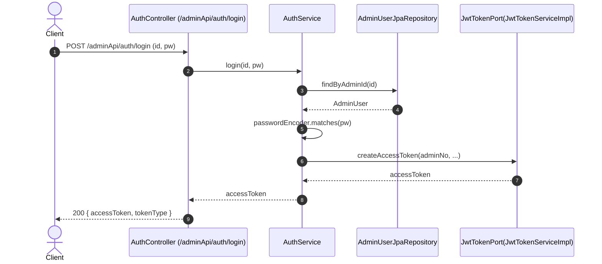
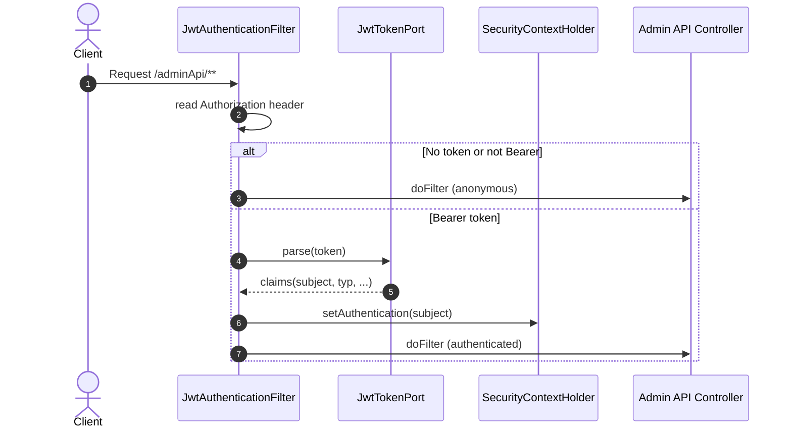
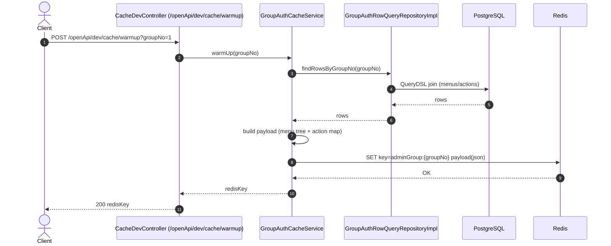

# Sequence Diagrams

## 1) Login -> Issue Access Token

```mermaid
sequenceDiagram
    autonumber
    actor Client
    participant AuthController as AuthController (/adminApi/auth/login)
    participant AuthService as AuthService
    participant AdminUserRepo as AdminUserJpaRepository
    participant Jwt as JwtTokenPort(JwtTokenServiceImpl)

    Client->>AuthController: POST /adminApi/auth/login (id, pw)
    AuthController->>AuthService: login(id, pw)
    AuthService->>AdminUserRepo: findByAdminId(id)
    AdminUserRepo-->>AuthService: AdminUser
    AuthService->>AuthService: passwordEncoder.matches(pw)
    AuthService->>Jwt: createAccessToken(adminNo, ...)
    Jwt-->>AuthService: accessToken
    AuthService-->>AuthController: accessToken
    AuthController-->>Client: 200 { accessToken, tokenType }
```

```mermaid
sequenceDiagram
    autonumber
    actor Client
    participant Filter as JwtAuthenticationFilter
    participant Jwt as JwtTokenPort
    participant SecurityContext as SecurityContextHolder
    participant Controller as Admin API Controller

    Client->>Filter: Request /adminApi/**
    Filter->>Filter: read Authorization header

    alt No token or not Bearer
        Filter->>Controller: doFilter (anonymous)
    else Bearer token
        Filter->>Jwt: parse(token)
        Jwt-->>Filter: claims(subject, typ, ...)
        Filter->>SecurityContext: setAuthentication(subject)
        Filter->>Controller: doFilter (authenticated)
    end
```

```mermaid
sequenceDiagram
    autonumber
    actor Client
    participant CacheDevController as CacheDevController (/openApi/dev/cache/warmup)
    participant CacheService as GroupAuthCacheService
    participant QueryRepo as GroupAuthRowQueryRepositoryImpl
    participant DB as PostgreSQL
    participant Redis as Redis

    Client->>CacheDevController: POST /openApi/dev/cache/warmup?groupNo=1
    CacheDevController->>CacheService: warmUp(groupNo)
    CacheService->>QueryRepo: findRowsByGroupNo(groupNo)
    QueryRepo->>DB: QueryDSL join (menus/actions)
    DB-->>QueryRepo: rows
    QueryRepo-->>CacheService: rows
    CacheService->>CacheService: build payload (menu tree + action map)
    CacheService->>Redis: SET key=adminGroup:{groupNo} payload(json)
    Redis-->>CacheService: OK
    CacheService-->>CacheDevController: redisKey
    CacheDevController-->>Client: 200 redisKey
```